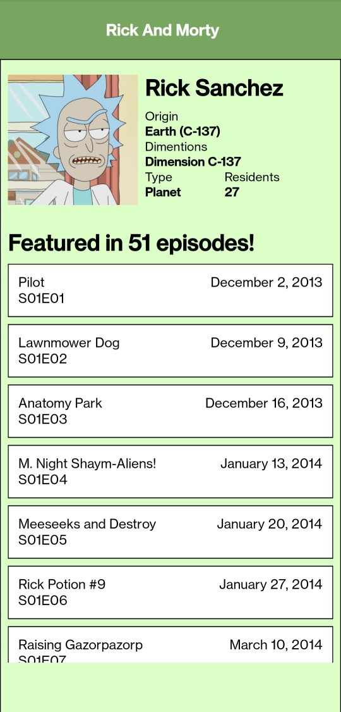

# Rick and Morty app based on React Native
ScreenRecord : [G-Drive](https://drive.google.com/drive/folders/1Wuya4EyXZEf8DGh_uJO-0PHyViWcb-rz?usp=sharing)

## Available Scripts

In the project directory, you can run:

### `npm start`

Runs the Metro server in the development mode. 

### `npm run test`

runs Jest

### `npm run lint`

run eslist

### `npm run android`

run app on installed android emulator
